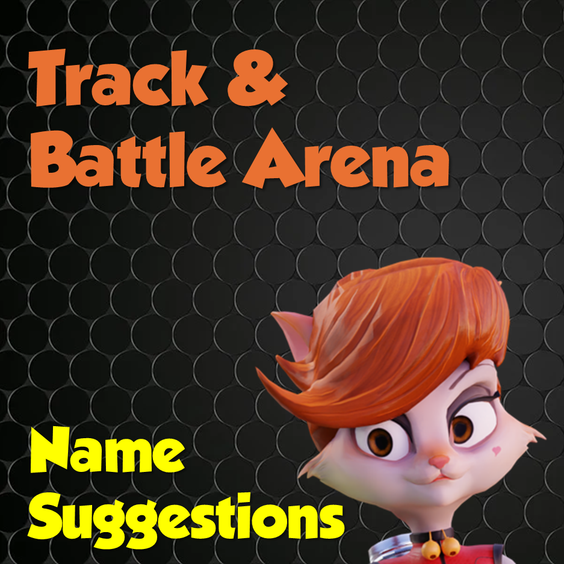
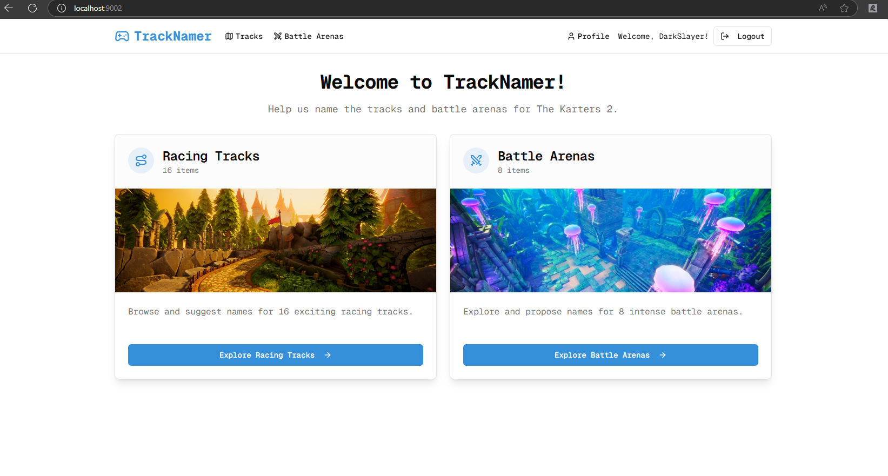
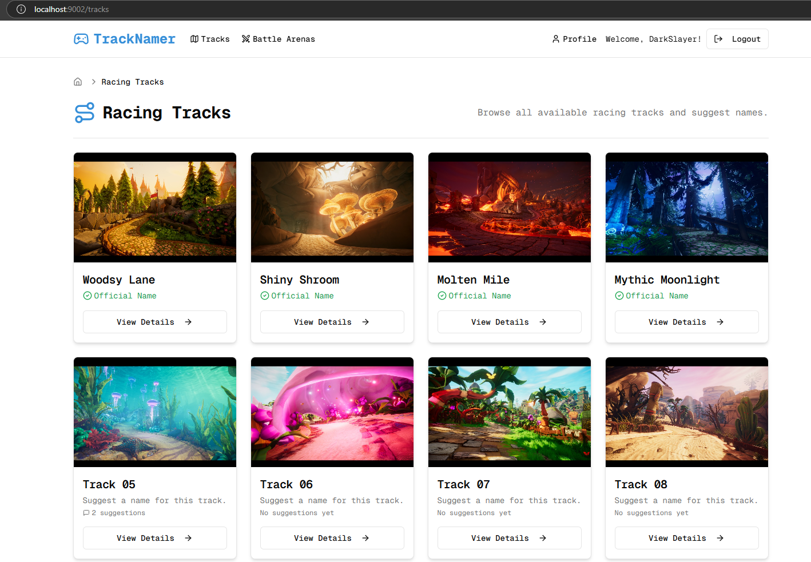
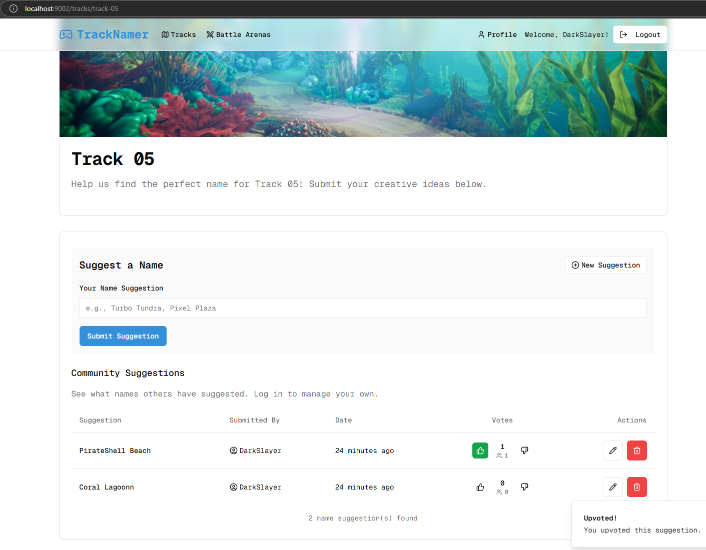
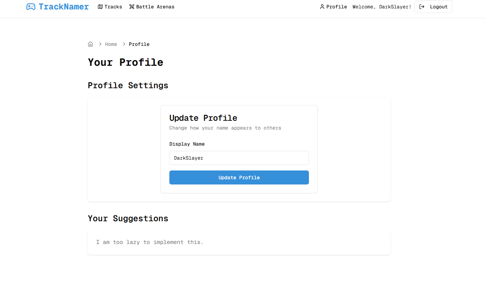

# TrackNamer

TrackNamer is a community-driven platform for "The Karters 2" where users can suggest and vote on names for racing tracks and battle arenas.



## 🎮 About

TrackNamer is a web application designed to crowdsource creative names for the racing tracks and battle arenas in "The Karters 2". The platform allows users to browse through various tracks and arenas, submit name suggestions, and vote on suggestions made by others.

## ✨ Features

- **Track & Arena Browsing**: Browse through a collection of racing tracks and battle arenas separated by category
- **Name Suggestions**: Suggest creative names for tracks and arenas as a logged-in user
- **Voting System**: Vote on suggestions made by other community members
- **User Profiles**: Manage your submitted suggestions and track your contribution history
- **Responsive Design**: Enjoy a seamless experience across desktop and mobile devices

## 📸 Screenshots

### Home Page


### Track Listing


### Track Details & Suggestions


### User Profile


## 🚀 Getting Started

### Prerequisites

- Node.js (v18 or higher)
- npm or yarn

### Installation

1. Clone the repository:
   ```bash
   git clone https://github.com/adelansari/tk2-track-namer.git
   cd tk2-track-namer
   ```

2. Install dependencies:
   ```bash
   npm install
   # or
   yarn install
   ```

3. Set up environment variables:
   Create a `.env.local` file in the project root and add the necessary environment variables.
   ```bash
   NEXT_PUBLIC_FIREBASE_API_KEY=
   NEXT_PUBLIC_FIREBASE_AUTH_DOMAIN=
   NEXT_PUBLIC_FIREBASE_PROJECT_ID=
   NEXT_PUBLIC_FIREBASE_STORAGE_BUCKET=
   NEXT_PUBLIC_FIREBASE_MESSAGING_SENDER_ID=
   NEXT_PUBLIC_FIREBASE_APP_ID=

   NEXT_PUBLIC_FIREBASE_FILESS_DATABASE=

   NEXT_PUBLIC_PROD_URL=
   NEXT_PUBLIC_ENVIRONMENT=
   ```

4. Initialize the database:
   ```bash
   npm run db:init
   # or
   yarn db:init
   ```

5. Start the development server:
   ```bash
   npm run dev
   # or
   yarn dev
   ```

6. Open [http://localhost:3000](http://localhost:3000) in your browser to see the application.

## 🛠️ Built With

- [Next.js](https://nextjs.org/) - React framework for server-side rendering
- [React](https://reactjs.org/) - Frontend JavaScript library
- [TypeScript](https://www.typescriptlang.org/) - Typed JavaScript
- [Tailwind CSS](https://tailwindcss.com/) - Utility-first CSS framework
- [Firebase Authentication](https://firebase.google.com/products/auth) - User authentication and profile management
- [PostgreSQL](https://www.postgresql.org/) - Database for storing suggestions and votes

## 🏗️ Architecture

### User Management
The application uses Firebase Authentication as the single source of truth for user data:

- **User Authentication**: Firebase Authentication handles user sign-up, sign-in, and session management
- **User Profiles**: User display names are stored and managed exclusively within Firebase Authentication
- **Server-Side Integration**: Firebase Admin SDK is used on the server to retrieve user display names when needed

This architecture simplifies user management by eliminating dual storage of user profile data.

## 🤝 Contributing

Contributions are welcome! Please feel free to submit a Pull Request.

1. Fork the project
2. Create your feature branch (`git checkout -b feature/amazing-feature`)
3. Commit your changes (`git commit -m 'Add some amazing feature'`)
4. Push to the branch (`git push origin feature/amazing-feature`)
5. Open a Pull Request

## 📝 License

This project is licensed under the MIT License - see the LICENSE file for details.

## 🙏 Acknowledgments

- The Karters 2 development team for creating an awesome game
- All community members who contribute name suggestions and feedback